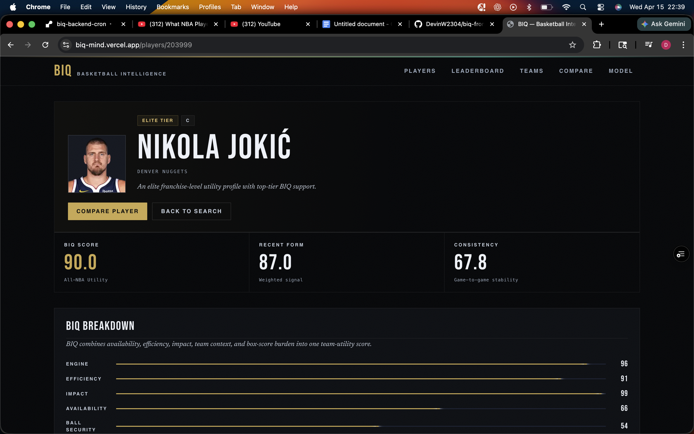

# BIQ Basketball

A full-stack basketball analytics app built to explore NBA data through a custom player rating system called **BIQ** (**Basketball IQ**).

BIQ Basketball started as a fun project and turned into a great way for me to dive deeper into data analytics, sports data, backend performance, and building a cleaner user-facing product around all of it. The app combines a custom scoring formula, searchable player and team pages, team dashboards, and a synced data pipeline to make basketball stats easier to explore and compare.

---

## Features

- Custom **BIQ** player rating formula
- NBA player leaderboard
- Player profile pages
- Team profile and dashboard pages
- Player and team search
- Cached backend responses for faster load times
- Data sync pipeline for processing NBA stats
- Full-stack architecture with separate frontend and backend layers

---

## BIQ Score Overview

The BIQ score is my custom formula for rating NBA players beyond just raw points per game.

It is designed to reward players who contribute in multiple ways, including:

- scoring
- playmaking
- rebounding
- defensive activity
- efficiency
- overall impact

The formula also tries to avoid overvaluing empty volume. A player scoring a lot inefficiently should not rate the same as someone contributing efficiently across the board. The goal is to create a more balanced rating that better reflects complete, winning basketball.

---

## Tech Stack

### Frontend
- Next.js
- React
- TypeScript
- CSS

### Backend
- FastAPI
- Python
- Pydantic

### Data / Analytics
- NBA stats data
- Custom BIQ scoring pipeline
- Local processed snapshots
- Caching layer for performance improvements

---

## Project Structure

```bash
biq-basketball/
├── frontend/              # Next.js frontend
├── backend/               # FastAPI backend
├── app/                   # API routes, services, models
├── data/                  # processed data / snapshots
├── scripts/               # sync and analytics scripts
├── lib/                   # shared frontend utilities
└── README.md
```

---

## Main Pages

### Home
The landing page introduces the BIQ concept and gives users a quick feel for the project. It acts as the front door to the app and sets up the analytics-first focus behind the platform.

### Players
The players page gives users a clean way to browse NBA players and explore their BIQ scores, stats, and rankings.

### Leaderboard
The leaderboard is one of the core views in the app. It ranks players using the BIQ formula so users can quickly compare overall impact and see how players stack up against each other.

### Player Profiles
Each player profile gives a more detailed look at that player’s stats and BIQ-related context, making it easier to go beyond surface-level numbers.

### Teams
The teams page lets users search for and explore team information instead of only focusing on individual player performance.

### Team Dashboards
Team dashboards add team-level context and help connect individual performance to the bigger picture.

### Compare
The compare page is built around making side-by-side analysis easier and gives the project room to expand into deeper comparison tools over time.

---

## What I Learned

This project helped me get better at:

- building a full-stack app around real-world data
- working with APIs and sync pipelines
- designing and refining a custom analytics formula
- thinking more critically about how stats should be weighted
- improving performance through caching and better backend structure
- turning technical data into a more usable product


## Current Focus

Right now, I’m mainly focused on:

- improving load times
- refining the BIQ formula
- expanding team dashboards
- improving sync reliability
- polishing the UI and overall experience

---

## Future Improvements

Some things I’d like to build next:

- matchup-based analysis
- lineup and positional context
- better charts and visualizations
- deeper team analytics
- More accurate BIQ formula

---

## Screenshots

### Home Page


### Player Leaderboard


### Player Profile



---

## Author

**Devin Washington**

GitHub: [@DevinW2304](https://github.com/DevinW2304)

---

## License

This project is mainly for learning, experimentation, and portfolio use.